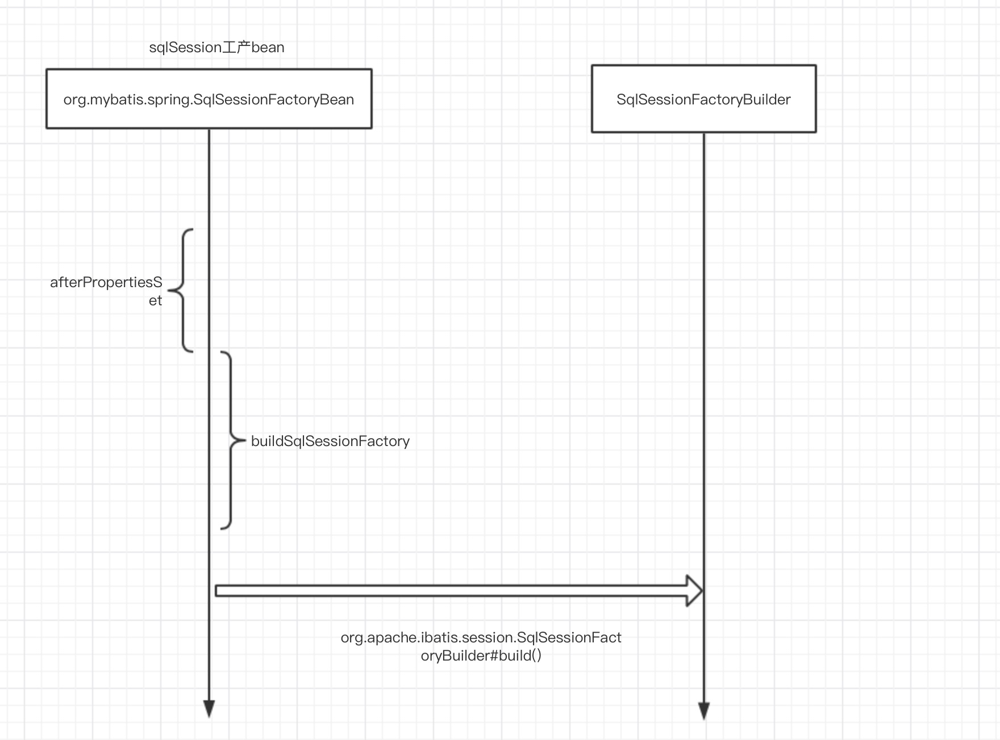

# mybatis spring 集成demo

## 1.环境

- jdk8
- mybatis3.5.2
- Spring 5.1.9.RELEASE
-  spring-jdbc 5.1.9.RELEASE


### 2.引入mybatis和spring包

```xml
  <dependency>
    <groupId>org.mybatis</groupId>
    <artifactId>mybatis-spring</artifactId>
    <version>2.0.2</version>
  </dependency>
  <dependency>
    <groupId>org.mybatis</groupId>
    <artifactId>mybatis</artifactId>
    <version>3.5.2</version>
  </dependency>
  ……………………
  <dependency>
    <groupId>org.springframework</groupId>
    <artifactId>spring-context</artifactId>
    <version>${spring.version}</version>
  </dependency>
  <dependency>
    <groupId>org.springframework</groupId>
    <artifactId>spring-jdbc</artifactId>
    <version>${spring.version}</version>
  </dependency>
```


###3.测试代码

```java
public class MbatisSpringTest
{
    public static void main( String[] args )
    {
        ApplicationContext ctx = new ClassPathXmlApplicationContext("application.xml");
        BlogMapper blogMapper = ctx.getBean(BlogMapper.class);
        blogMapper.selectBlog(1);
    }
}
```


### 4.spring xml配置文件

下面xml配置只是为了解读mybatis spring 源码，生产环境不会用下面配置

```xml

    <!-- spring jdbc 数据源配置-->
    <bean id="dataSource" class="org.springframework.jdbc.datasource.DriverManagerDataSource">

        <property name="driverClassName" value="com.mysql.jdbc.Driver" />

        <property name="url" value="jdbc:mysql://localhost:3306/test" />

        <property name="username" value="root" />

        <property name="password" value="123456" />
    </bean>

    <!-- mybatis  SqlSessionFactory配置-->
    <bean id="sqlSessionFactory" class="org.mybatis.spring.SqlSessionFactoryBean">
        <property name="dataSource" ref="dataSource" />
        <!-- 自动扫描路径下xml文件-->
<!--     <property name="mapperLocations" value="classpath*:mapper/*.xml" />-->

        <!-- 自动扫描路径下配置文件-->
        <property name="configLocation" value="classpath:mybatis-config.xml"/>
    </bean>

    <!-- mapper 配置-->
    <bean id="mpperFactoryBean" class="org.mybatis.spring.mapper.MapperFactoryBean">
        <property name="mapperInterface" value="com.zzm.dao.BlogMapper" />
        <property name="sqlSessionFactory" ref="sqlSessionFactory" />
    </bean>
```

`SqlSessionFactoryBean`：创建SqlSessionFactory,配置SqlSessionFactoryBean需要DataSource，

DataSource可以使用任何数据源。

`MapperFactoryBean`:需要配置`SqlSessionFactory` 和接口，上面配置是访问数据库dao层，创建`SqlSessionTemplate` 来管理`SqlSession`。

`SqlSessionTemplate` : 通过`sqlSessionFactory`获取`SqlSession`  生成`sqlSessionProxy`, 上面例子blogMapper.selectBlog(1)中，真正执行`sqlSessionProxy` 调用`org.mybatis.spring.SqlSessionTemplate.SqlSessionInterceptor` 方法，调用`org.apache.ibatis.session.defaults.DefaultSqlSession`中方法

```java
  PersistenceExceptionTranslator exceptionTranslator) {

    notNull(sqlSessionFactory, "Property 'sqlSessionFactory' is required");
    notNull(executorType, "Property 'executorType' is required");

    this.sqlSessionFactory = sqlSessionFactory;
    this.executorType = executorType;
    this.exceptionTranslator = exceptionTranslator;
    this.sqlSessionProxy = (SqlSession) newProxyInstance(SqlSessionFactory.class.getClassLoader(),
        new Class[] { SqlSession.class }, new SqlSessionInterceptor());
  }
```


### 5.`SqlSessionFactoryBean` 和`MapperFactoryBean`初始化和执行流程图

 #### 5.1.MapperFactoryBean初始化


####5.2.SqlSessionFactoryBean初始化




#### 5.3.mapper执行流程


[参考链接](https://www.jianshu.com/p/d63884700044)

[源码地址](https://github.com/knowledgeAlan/arts-seven)

